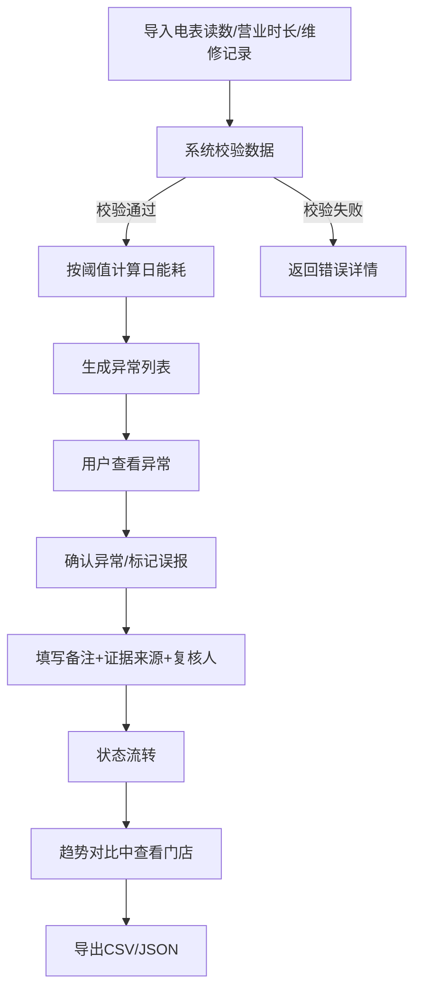
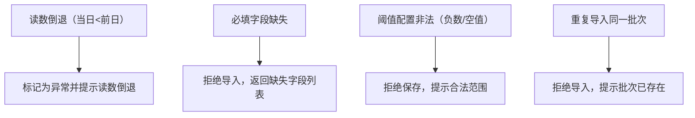

## 1. 产品概述

门店能耗异常复盘看板是一款面向连锁门店运营与能源管理团队的工具型 Web 应用。通过导入电表日读数、营业时长和维修记录，结合本地可配置阈值自动识别异常能耗，支持异常归因、复核状态流转、趋势对比和证据留存，帮助团队高效完成能耗异常的发现—确认—复盘闭环。

- 解决问题：门店能耗异常依赖人工排查、异常证据散落、复核流程无追踪
- 目标用户：连锁零售/餐饮企业能源管理岗、门店运营督导

## 2. 核心功能

### 2.1 用户角色

| 角色 | 注册方式 | 核心权限 |
|------|----------|----------|
| 能源管理员 | 默认角色 | 导入数据、配置阈值、确认/驳回异常、导出 |
| 运营督导 | 默认角色 | 查看异常、添加备注、标记误报 |

### 2.2 功能模块

1. **总览看板**: 关键指标卡片（总门店数/异常数/待复核数）、异常门店分布、近期异常趋势
2. **数据管理**: 批次导入电表读数/营业时长/维修记录、阈值配置面板、数据校验与错误提示
3. **异常复盘**: 异常列表（筛选/排序）、复核状态流转、异常归因标签、门店趋势对比图、CSV/JSON 导出

### 2.3 页面详情

| 页面名称 | 模块名称 | 功能描述 |
|----------|----------|----------|
| 总览看板 | 指标卡片 | 显示门店总数、异常门店数、待复核数、已确认数、误报数 |
| 总览看板 | 异常分布 | 按门店分组的异常数量柱状图，点击可跳转异常列表 |
| 总览看板 | 近期趋势 | 近7天每日新增异常折线图 |
| 数据管理 | 批次导入 | 支持上传 CSV/JSON 文件，解析后预览并确认导入，校验必填字段和数据一致性 |
| 数据管理 | 导入记录 | 展示历史导入批次，支持查看详情和拒绝重复批次 |
| 数据管理 | 阈值配置 | 按门店/全局设置日能耗上限、环比波动阈值、营业时长修正系数，实时校验合法性 |
| 异常复盘 | 异常列表 | 表格展示所有异常记录，支持按状态/门店/日期筛选，点击展开详情 |
| 异常复盘 | 复核操作 | 状态流转：待复核→已确认/误报→已关闭，需填写备注和证据来源 |
| 异常复盘 | 归因标签 | 为异常打标签：读数异常/设备故障/维修干扰/季节波动/其他 |
| 异常复盘 | 趋势对比 | 选择门店后展示能耗趋势折线图，标注异常点和维修区间 |
| 异常复盘 | 数据导出 | 支持将筛选后的异常列表导出为 CSV 或 JSON 格式，保留备注/证据/复核人信息 |

## 3. 核心流程

### 3.1 主流程：数据导入→异常检测→复核→趋势查看

用户通过数据管理页面批次导入电表读数，系统根据阈值配置自动计算日能耗并标记异常。用户在异常复盘页面查看异常列表，对某条异常执行确认或标记误报操作（需填写备注和证据来源），确认后在趋势对比中可查看该门店的能耗走势与异常标注。

### 3.2 失败路径

## 4. 用户界面设计

### 4.1 设计风格

- **主色调**: 深靛蓝(#1e293b)为底色，琥珀色(#f59e0b)为异常警示色，翡翠绿(#10b981)为正常状态色
- **辅助色**: 石板灰系列用于文本和边框，红色(#ef4444)用于严重异常
- **按钮风格**: 圆角8px，主要操作实心填充，次要操作边框样式
- **字体**: DM Sans（正文）+ Space Grotesk（标题/数字），数据表格使用等宽字体 JetBrains Mono
- **布局风格**: 左侧固定导航栏 + 右侧内容区，内容区卡片式布局
- **图标**: lucide-react 图标库

### 4.2 页面设计概览

| 页面名称 | 模块名称 | UI元素 |
|----------|----------|--------|
| 总览看板 | 指标卡片 | 5张统计卡片，数字大字号，趋势小箭头，hover微动效 |
| 总览看板 | 异常分布 | 横向柱状图，门店名称+异常计数，颜色编码严重程度 |
| 总览看板 | 近期趋势 | 7日折线图，区域填充，hover显示详情tooltip |
| 数据管理 | 批次导入 | 拖拽上传区域+文件选择按钮，预览表格，校验结果面板 |
| 数据管理 | 阈值配置 | 表单卡片组，数值输入+滑块，实时校验反馈，保存/重置按钮 |
| 异常复盘 | 异常列表 | 数据表格，状态徽章，行展开详情面板，顶部筛选栏 |
| 异常复盘 | 复核操作 | 模态对话框，状态选择+备注文本框+证据来源输入 |
| 异常复盘 | 趋势对比 | 双轴折线图（能耗+营业时长），异常点标记，维修区间阴影 |
| 异常复盘 | 数据导出 | 下拉菜单选择格式，导出按钮，进度提示 |

### 4.3 响应式设计

- 桌面优先设计，最小宽度1024px
- 导航栏在窄屏下收起为图标模式
- 表格在窄屏下隐藏次要列
- 图表自适应容器宽度

## 5. 数据持久化要求

- 应用重启后所有数据不丢失：已导入的读数、阈值配置、异常记录、复核状态、备注、证据来源、复核人
- 重新计算异常时，已关闭（已确认/误报）的异常记录及其备注、证据来源、复核人必须保留
- 导出内容必须包含完整的复核信息
