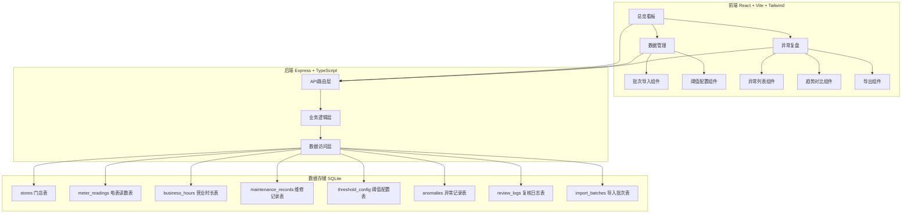
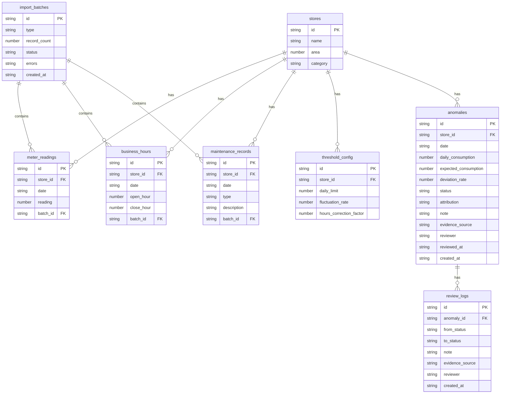

## 1. 架构设计



## 2. 技术说明

- **前端**: React@18 + TypeScript + TailwindCSS@3 + Vite
- **初始化工具**: vite-init (react-express-ts 模板)
- **后端**: Express@4 + TypeScript (ESM)
- **数据库**: SQLite (better-sqlite3)，数据文件存储在项目根目录 `data/app.db`
- **状态管理**: Zustand
- **图表库**: Recharts
- **路由**: react-router-dom
- **图标**: lucide-react
- **文件解析**: PapaParse (CSV解析)
- **日期处理**: date-fns

## 3. 路由定义

| 路由 | 用途 |
|------|------|
| `/` | 总览看板，显示关键指标和异常概览 |
| `/data` | 数据管理，批次导入和阈值配置 |
| `/anomaly` | 异常复盘，异常列表和趋势对比 |

## 4. API 定义

### 4.1 数据导入

```
POST /api/import/readings     — 批次导入电表读数
POST /api/import/hours        — 批次导入营业时长
POST /api/import/maintenance  — 批次导入维修记录
GET  /api/import/batches      — 获取导入批次列表
```

### 4.2 阈值配置

```
GET    /api/thresholds         — 获取所有阈值配置
PUT    /api/thresholds/:storeId — 更新指定门店阈值
PUT    /api/thresholds/global  — 更新全局默认阈值
```

### 4.3 异常管理

```
GET    /api/anomalies          — 获取异常列表（支持筛选参数）
PUT    /api/anomalies/:id/review — 复核操作（确认/误报/关闭）
POST   /api/anomalies/recalculate — 重新计算异常
GET    /api/anomalies/export   — 导出异常数据（?format=csv|json）
```

### 4.4 趋势数据

```
GET /api/trends/:storeId — 获取指定门店趋势数据
GET /api/dashboard/stats — 获取总览统计数据
```

### 4.5 TypeScript 类型定义

```typescript
interface Store {
  id: string;
  name: string;
  area: number;
  category: string;
}

interface MeterReading {
  id: string;
  storeId: string;
  date: string;
  reading: number;
  batchId: string;
}

interface BusinessHours {
  id: string;
  storeId: string;
  date: string;
  openHour: number;
  closeHour: number;
  batchId: string;
}

interface MaintenanceRecord {
  id: string;
  storeId: string;
  date: string;
  type: string;
  description: string;
  batchId: string;
}

interface ThresholdConfig {
  id: string;
  storeId: string | null;
  dailyLimit: number;
  fluctuationRate: number;
  hoursCorrectionFactor: number;
}

interface Anomaly {
  id: string;
  storeId: string;
  date: string;
  dailyConsumption: number;
  expectedConsumption: number;
  deviationRate: number;
  status: "pending" | "confirmed" | "false_positive" | "closed";
  attribution: string | null;
  note: string | null;
  evidenceSource: string | null;
  reviewer: string | null;
  reviewedAt: string | null;
  createdAt: string;
}

interface ReviewLog {
  id: string;
  anomalyId: string;
  fromStatus: string;
  toStatus: string;
  note: string;
  evidenceSource: string;
  reviewer: string;
  createdAt: string;
}

interface ImportBatch {
  id: string;
  type: "readings" | "hours" | "maintenance";
  recordCount: number;
  status: "success" | "partial" | "failed";
  errors: string | null;
  createdAt: string;
}
```

## 5. 数据模型

### 5.1 数据模型定义



### 5.2 异常检测算法

```
日能耗 = 当日读数 - 前日读数
若日能耗 < 0 → 标记为"读数倒退"异常
预期能耗 = 全局/门店阈值.dailyLimit × (营业时长/标准时长) × hoursCorrectionFactor
偏差率 = (日能耗 - 预期能耗) / 预期能耗 × 100%
若偏差率 > fluctuationRate → 标记为异常
若当日有维修记录 → 归因标签默认为"维修干扰"
```

### 5.3 样例数据设计

覆盖3类门店场景：
- **正常门店**（门店A）：读数稳定增长，能耗在阈值内，无异常
- **异常门店**（门店B）：某日能耗突增，超出阈值，需确认
- **维修干扰门店**（门店C）：维修期间能耗异常，应标记为维修干扰

数据量：3个门店 × 14天 = 42条读数记录 + 对应营业时长 + 2条维修记录
